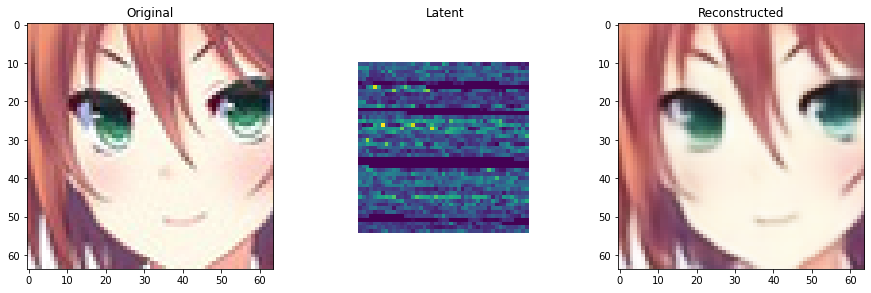
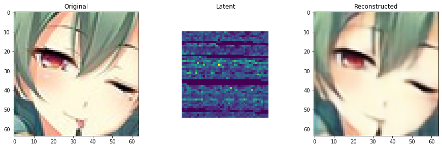
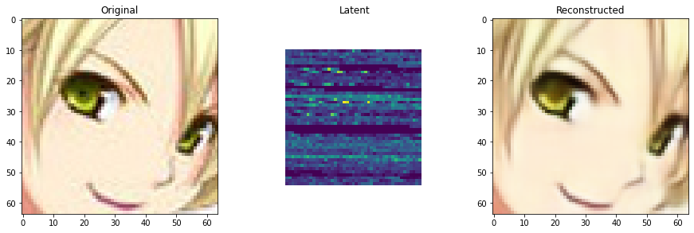
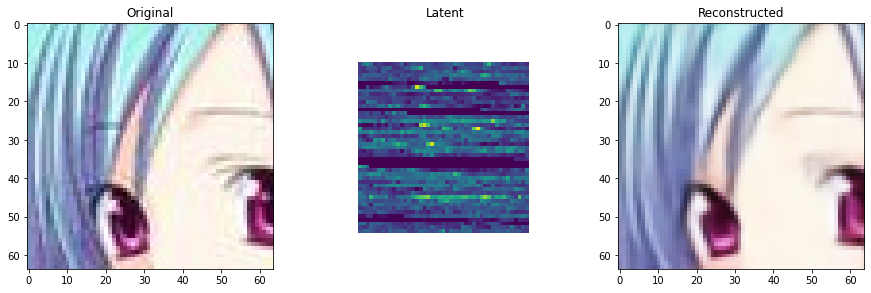

# ReconstructionOfImage-Using-DeepAutoEncoders
I have reconstructed the image by compressing it to 6X. My dataset contains 64k anime images. Out of 64k images I randomly chose 10 images and constructed a seperate directory containing 200000(2lakh) Images. It is obvious that it seems crazy to generate 2 lakh images using 10 images but this is a part of data augumentation.My model took 12288 dimension image input and reduced the output to just 2048 dimension by retaining all the important features of the images.

# Autoencoders
Autoencoder is a type of neural network where the output layer has the same dimensionality as the input layer. In simpler words, the number of output units in the output layer is equal to the number of input units in the input layer. An autoencoder replicates the data from the input to the output in an unsupervised manner and is therefore sometimes referred to as a replicator neural network.  The autoencoders reconstruct each dimension of the input by passing it through the network. It may seem trivial to use a neural network for the purpose of replicating the input, but during the replication process, the size of the input is reduced into its smaller representation. The middle layers of the neural network have a fewer number of units as compared to that of input or output layers. Therefore, the middle layers hold the reduced representation of the input. The output is reconstructed from this reduced representation of the input.

An autoencoder consists of three components:

Encoder: An encoder is a feedforward, fully connected neural network that compresses the input into a latent space representation and encodes the input image as a compressed representation in a reduced dimension. The compressed image is the distorted version of the original image.
Code: This part of the network contains the reduced representation of the input that is fed into the decoder.
Decoder: Decoder is also a feedforward network like the encoder and has a similar structure to the encoder. This network is responsible for reconstructing the input back to the original dimensions from the code.

# Output
 

